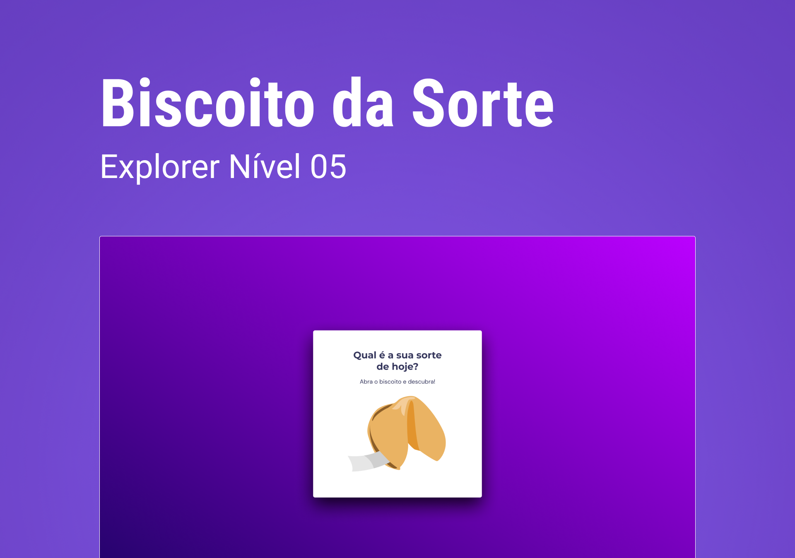

  

<!--  -->

<h2 align="center">Tecnologias 🚀</h2>
   

Esse projeto foi desenvolvido com as seguintes tecnologias:

- **HTML**
- **CSS** 
- **JAVASCRIPT**
- ** Estrutura de dados HTML**
- **Animações com CSS**
- **Funções no Javascript**
- **Manipulação da DOM**
- **Biblioteca JS Math()**
- **Funções *callback**
- **Arrays**

  
  ---
  <h3 align="center">Projeto💻 </h3>
  
Acesse o projeto em <a href="https://micaela-marques.github.io/jogodaadivinha-o/"> site🌐
  

---
